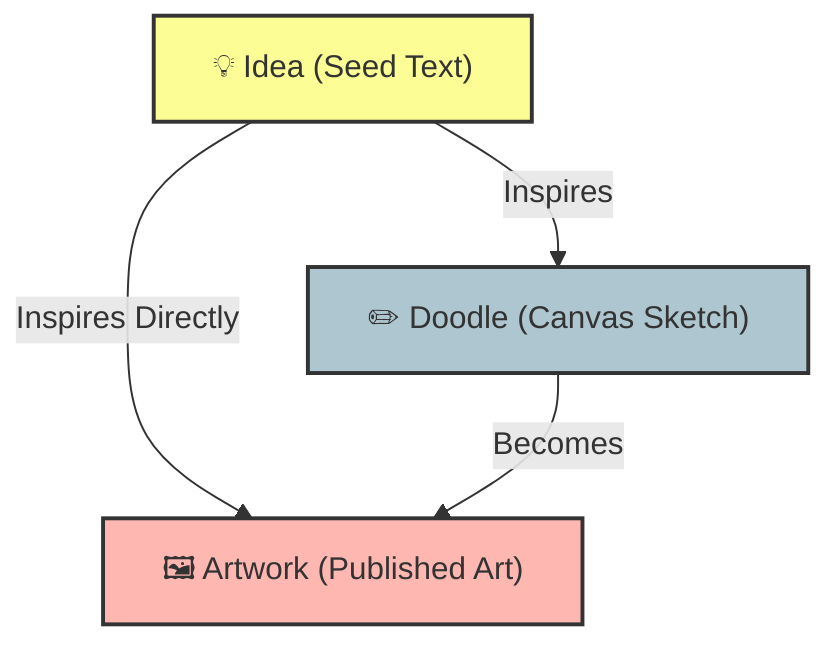

# whatdoidraw? (wdid?) 🎨✨

**whatdoidraw?** is a collaborative social network built for artists and creators to **fight creative block**. Through a continuous inspiration loop, the platform connects users to turn abstract ideas into interactive sketches and, ultimately, into finished artwork.

---

<div align="center">

[](https://flutter.dev)
[](https://supabase.com)
[](https://riverpod.dev)
[](https://www.postgresql.org)
[](https://opensource.org/licenses/MIT)

</div>

---

## 💡 The Concept: Creative Lineage

Unlike a conventional portfolio, **whatdoidraw?** surfaces and interconnects the evolution of inspiration across three hierarchical levels:

1. **💡 Ideas (Seed Prompts):** Root text nodes where any user proposes a creative concept (e.g. *"An astronaut cat drinking coffee"*).
2. **✏️ Doodles (Canvas Sketches):** Vector drawings made in real time on the app's interactive canvas, optionally based on an Idea.
3. **🖼️ Artworks (Finished Art):** Completed pieces published on external platforms (Bluesky, DeviantArt, etc.) that link back to their originating Doodle or Idea, documenting the full genealogy of the work.



---

## 🛠️ Notable Tech & Architecture

### 1. 🖌️ Native 2D Vector Drawing Engine
* **No external libraries:** Built from scratch using Flutter's **`CustomPainter`** and **`GestureDetector`**.
* **Ultra-lightweight serialization (Vector JSON):** Instead of uploading heavy image files (PNG/JPG) to the cloud, the app captures strokes as mathematical vector coordinates (`Offset`) and serializes them as a **JSON** array in PostgreSQL. This drastically reduces storage (kilobytes vs. megabytes) and lets sketches render crisp at any resolution, with future support for stroke-creation animation.
* **Zoom & Interaction:** `InteractiveViewer` integration that smoothly balances single-finger drawing with two-finger pan/zoom.

### 2. ⚡ Architecture & Reactive State
* **Pragmatic MVVM (Feature-Driven):** Modular, decoupled codebase organized by feature with strict separation between UI (View), business logic (ViewModel), and data infrastructure (Service).
* **Riverpod with Generators (`@riverpod`):** Efficient, modular reactivity. All ViewModel state is managed as an immutable auto-generated object via `@freezed`, with dedicated reactive controllers for loading, error, and real-time data.
* **Optimistic UI:** High-frequency interactions (Likes, bookmarks) use optimistic updates to give instant tactile feedback before the server transaction is confirmed.

### 3. 🗄️ Backend (Supabase & PostgreSQL)
* **Efficient Pagination:** Lazy feed loading via `.range()`, advanced tag filtering using Postgres's native `VARCHAR[]` type and its `.contains()` operator to minimize query cost.
* **Active Database:** Custom SQL triggers and Postgres functions in Supabase automatically manage interaction counters and dispatch real-time internal notifications when inspiration relationships are detected.
* **Security & Privacy:** Robust Row-Level Security (RLS) policies protecting user data and identity on every direct query.

### 4. 🎨 Dynamic Theme System & Localization
* **Live Custom Themes:** On-the-fly theme switching persisted locally with `SharedPreferences` (Dark Deep Purple, Light Nordic Clean with 60-30-10 rule, and Calm Dark Green Forest).
* **Native i18n:** Multi-language support (Spanish & English) synced and persisted at the user level.

---

## 📂 Code Structure

```text
lib/
├── core/                       # Core integrations and infrastructure
│   ├── providers/              # Global providers (Supabase, etc.)
│   ├── theme/                  # Global design system (Colors, HSL, typography)
│   └── constants/              
├── features/                   # Domain-encapsulated modules
│   ├── feed/                   # Discovery of Ideas, Doodles, and Artworks
│   ├── canvas/                 # Drawing engine, canvas ViewModel, and saving
│   ├── notifications/          # Real-time notification center
│   └── ...                     
├── shared/                     # Cross-cutting code and components
│   ├── models/                 # Immutable domain models (Freezed)
│   └── widgets/                # Reusable common UI (TagInputField, TagChip, etc.)
└── main.dart                   # Application entry point
```

---

## 📖 Internal Documentation

For a deep dive into the app's logic and design, explore the specific guides:
* 🚀 **[Setup Guide](docs/SETUP.md)**
* 🎨 **[Canvas & Drawing Engine](docs/CANVAS_ENGINE.md)**
* ⛓️ **[Creative Lineage System](docs/CREATIVE_LINEAGE.md)**
* 🏷️ **[Tags & Feed System](docs/TAGS_SYSTEM.md)**
* 💖 **[Optimistic Likes System](docs/LIKES_SYSTEM.md)**
* 🌐 **[Internationalization & i18n](docs/LANGUAGE_SYSTEM.md)**
* 🗄️ **[SQL Database Schema](docs/DATABASE_SCHEMA.md)**

---

> [Spanish version / Versión en español](docs/readme_spanish.md)
