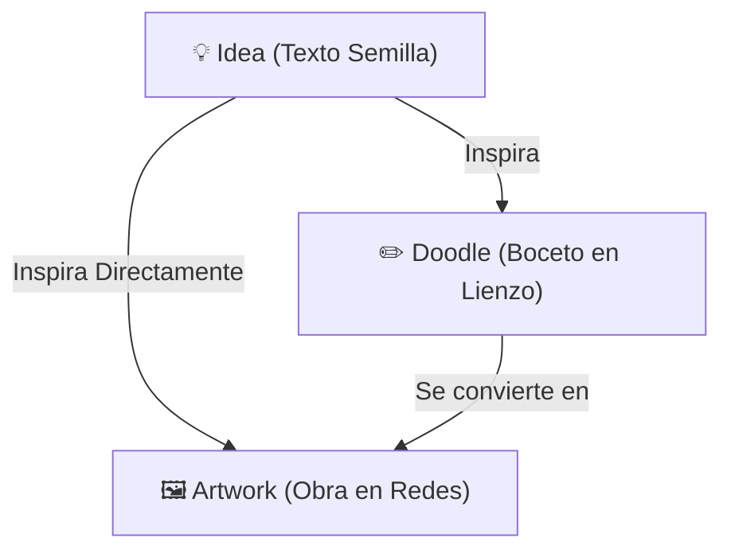

# Sistema de Linaje Creativo y Exploración de Relaciones (Creative Lineage) 🎨

Este documento detalla el diseño, la arquitectura y el funcionamiento del **Sistema de Linaje Creativo** en **whatdoidraw?**, el cual permite documentar y navegar por la evolución de una idea desde su concepción en texto hasta la obra de arte final.

---

## 1. Visión General del Linaje

Para combatir el bloqueo creativo, **wdid?** no solo muestra creaciones aisladas, sino que expone la genealogía completa de la inspiración. La estructura de relaciones está formada por tres niveles de jerarquía:

*   **Idea (Prompt Semilla):** Nodo raíz de texto creado por un usuario.
*   **Doodle (Boceto):** Nodo intermedio dibujado en la aplicación, que puede estar basado de forma opcional en una `Idea`.
*   **Artwork (Arte Final):** Nodo terminal que representa una obra externa (ej. Bluesky, DeviantArt). Está enlazado obligatoriamente a una `Idea` o un `Doodle`.

---

## 2. Pantallas de Exploración y Detalle

Cada tipo de contenido cuenta con una pantalla de exploración dedicada y optimizada bajo el patrón **MVVM** con **Riverpod**.

### A. Detalle de Idea (`IdeaDetailScreen`)
Muestra el texto semilla original y, a continuación, un feed unificado de todos los elementos que ha inspirado.
*   **Gestión de Estado:** `IdeaDetailNotifier` (generado como `ideaDetailProvider(ideaId)`).
*   **Flujo Cronológico Unificado:** En lugar de pestañas separadas, los *Doodles* y *Artworks* derivados se fusionan en una sola lista combinada que se ordena de manera estrictamente cronológica inversa (más reciente primero), facilitando una lectura natural de la evolución de la idea.
*   **Sincronización:** Escucha cambios en tiempo real del estado de likes para mantener sincronizados los contadores.

### B. Detalle de Boceto (`DoodleDetailScreen`)
Permite visualizar el dibujo en alta definición e interactuar con su lienzo, añadiendo un panel de exploración de relaciones.
*   **Gestión de Estado:**
    *   `DoodleDetailNotifier` (`doodleDetailProvider`): Resuelve la información del doodle y su idea semilla (si aplica).
    *   `DoodleDetailArtworksNotifier` (`doodleDetailArtworksProvider`): Controla de forma aislada la paginación de obras finales.
*   **Exploración de Relaciones (Acciones Expandibles):**
    *   **Ver idea original:** Muestra en un card interactivo la idea raíz de texto que inspiró el dibujo, pudiendo ocultarse a voluntad.
    *   **Obras compartidas:** Carga y muestra los primeros 10 *Artworks* creados a partir de este doodle. Si existen más, despliega un botón dinámico para realizar paginación bajo demanda (*Load More*).
*   **Interactividad:** Permite hacer zoom interactivo sobre el lienzo usando un visor de gestos y proporciona accesos rápidos para "Crear otro boceto" o "Subir obra final" basados en el mismo prompt.

### C. Detalle de Obra (`ArtworkDetailScreen`)
Pantalla dedicada a la visualización de una obra de arte final, su procedencia y su previsualización interactiva.
*   **Gestión de Estado:** `ArtworkDetailNotifier` (generado como `artworkDetailProvider(artworkId)`).
*   **Previsualizaciones Inteligentes:**
    *   Si la obra pertenece a plataformas con *oEmbed* público (como DeviantArt o Bluesky), la aplicación renderiza directamente una previsualización de alta calidad.
    *   Para otras plataformas externas con seguridad restringida, se muestra una tarjeta con un marcador de posición de diseño premium indicando la procedencia del enlace.
*   **Visualización de Genealogía (Inspiración):**
    Muestra de forma jerárquica el camino completo de inspiración:
    1.  **Caso Completo (Idea + Doodle):** Si el Artwork se basó en un Doodle que a su vez nació de una Idea, se muestran numerados tanto la **Idea Semilla Original** como el **Boceto de Inspiración**.
    2.  **Caso Medio (Solo Doodle o Solo Idea):** Se despliega una sola tarjeta indicando la procedencia del prompt o boceto directo.
    3.  **Caso Independiente:** Si la obra fue subida sin origen vinculado, se muestra un aviso contextual elegante.

---

## 3. Capa de Servicios y API (Supabase)

La persistencia y el filtrado relacional se realizan en el archivo `FeedService` (`feed_service.dart`) mediante llamadas optimizadas en Postgres:

| Método | Descripción | Retorno |
| :--- | :--- | :--- |
| `getIdeaById(String id)` | Recupera una idea y mapea su autor. | `Future<IdeaModel?>` |
| `getDoodleById(String id)` | Recupera un boceto, sus trazos vectoriales y su autor. | `Future<DoodleModel?>` |
| `getArtworkById(String id)` | Recupera una obra final externa y su autor. | `Future<ArtworkModel?>` |
| `getDoodlesByIdeaId(String id)` | Obtiene los bocetos vinculados a una idea. | `Future<List<DoodleModel>>` |
| `getArtworksByIdeaId(String id)` | Obtiene obras finales enlazadas directamente a una idea. | `Future<List<ArtworkModel>>` |
| `getArtworksByDoodleId(String id, {limit, offset})` | Obtiene obras finales enlazadas a un doodle con soporte de paginación. | `Future<List<ArtworkModel>>` |

---

## 4. Navegación Fluida (Traversability)

Tanto `IdeaCard` como `ArtworkCard` y `DoodleCard` cuentan con un parámetro reactivo `isClickable` (que por defecto es `true`).
*   Esto habilita que cualquier listado general de la aplicación actúe como un portal interactivo.
*   Al pulsar sobre cualquier elemento del linaje en cualquier pantalla (incluyendo las secciones de genealogía), la aplicación realiza una transición de página navegando de forma recursiva hacia el detalle de ese nodo, permitiendo una exploración orgánica del contenido.
