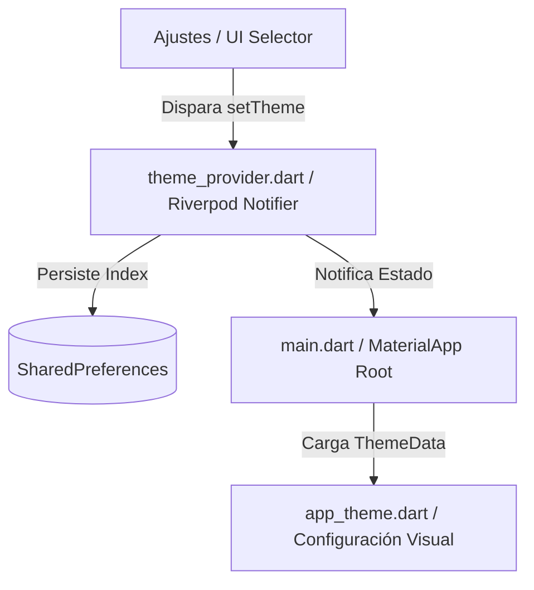

# Manual Técnico - Sistema de Temas y Personalización 🎨

Este manual técnico explica la arquitectura del sistema de temas dinámicos y persistentes implementado en **whatdoidraw?**, y ofrece una guía práctica paso a paso sobre cómo añadir nuevos temas visuales a la aplicación en el futuro.

---

## 🏗️ Arquitectura del Sistema

El sistema de temas está diseñado de forma modular y reactiva, dividiendo la responsabilidad en cuatro componentes principales del patrón MVVM:



### 1. Catálogo de Temas (`lib/core/theme/app_theme.dart`)
Define los temas disponibles mediante el enum `AppThemeMode` y centraliza la generación de sus configuraciones estéticas en la clase `AppThemes`.
Utiliza **semillas de esquema de color (Seed ColorSchemes)** de Material 3 para generar de forma inteligente colores armonizados (primarios, secundarios, contenedores, fondos, etc.) basándose en un único color semilla principal.

Temas iniciales soportados:
*   **Oscuro (Dark)**: El tema morado elegante por defecto (Semilla: `Colors.deepPurpleAccent`).
*   **Claro (Light)**: El tema basado en el estilo **"Nordic Clean"** y la regla de color 60-30-10:
    *   **60% Fondo**: Blanco puro (`#FFFFFF`) para una legibilidad y contraste óptimos.
    *   **30% Texto/Estructura**: Carbón profundo (`#1A202C`) asegurando un ratio de contraste de al menos 4.5:1.
    *   **10% Llamadas a la acción (CTA)**: Verde azulado/teal apagado (`#008080`) estrictamente reservado para botones de acción primarios e indicaciones activas.
*   **Verde Oscuro (Dark Green)**: Un tema oscuro relajante y natural basado en tonos bosque y verde pino (Semilla: `Colors.tealAccent`).

### 2. Proveedor de Estado Reactivo (`lib/core/providers/theme_provider.dart`)
El notifier `AppThemeNotifier` (compilado automáticamente por Riverpod como `appThemeProvider` en el código generado) mantiene el estado en tiempo real de la interfaz.
Al construirse (`build()`), lee síncronamente de `SharedPreferences` la clave `selected_theme_mode` para cargar el tema anterior del usuario. Si no existe, aplica el tema `dark` por defecto.

### 3. Persistencia Local (`SharedPreferences`)
Para evitar retrasos en el arranque de la app o flashes visuales durante el inicio, guardamos la selección del usuario localmente usando el índice numérico del enum (`mode.index`).

### 4. Inyección Global (`lib/main.dart`)
La raíz del árbol de widgets `WdidApp` observa reactivamente al `appThemeProvider`. Cualquier cambio en el tema actual redibuja de forma instantánea toda la aplicación con transiciones visuales nativas de gran suavidad.

---

## 🛠️ Guía Paso a Paso: Cómo Añadir un Nuevo Tema

Añadir un tema nuevo es extremadamente sencillo y rápido gracias al uso de semillas de color de Material 3. Sigue estos 4 pasos para agregar tu propio tema (por ejemplo, un tema de color naranja "Sunset"):

### Paso 1: Añadir el tema al enum `AppThemeMode`
Abre [lib/core/theme/app_theme.dart](file:///c:/Users/wissp/AndroidStudioProjects/whatdoidraw/lib/core/theme/app_theme.dart) y añade el nombre de tu nuevo tema al enum:

```diff
 enum AppThemeMode {
   dark,
   light,
-  darkGreen;
+  darkGreen,
+  sunsetOrange; // <- Añadido
```

### Paso 2: Registrar el nombre para mostrar en pantalla
En el mismo archivo, dentro de la propiedad `displayName` del enum, añade el texto en español que verán los usuarios en la pantalla de Ajustes:

```diff
   String get displayName {
     switch (this) {
       case AppThemeMode.dark:
         return 'Oscuro (Dark)';
       case AppThemeMode.light:
         return 'Claro (Light)';
       case AppThemeMode.darkGreen:
         return 'Verde Oscuro (Dark Green)';
+      case AppThemeMode.sunsetOrange:
+        return 'Atardecer Naranja'; // <- Nombre visual
     }
   }
```

### Paso 3: Configurar el diseño visual y esquema de color
En la misma clase `AppThemes`, añade el caso en el `switch` para configurar el `ThemeData` de tu nuevo tema. Puedes elegir si es un tema claro (`Brightness.light`) o un tema oscuro (`Brightness.dark`) y su color semilla principal:

```diff
   static ThemeData getThemeData(AppThemeMode mode) {
     switch (mode) {
       case AppThemeMode.dark:
         ...
       case AppThemeMode.darkGreen:
         ...
+      case AppThemeMode.sunsetOrange:
+        return ThemeData(
+          useMaterial3: true,
+          colorScheme: ColorScheme.fromSeed(
+            seedColor: Colors.orangeAccent,
+            brightness: Brightness.dark, // Tema oscuro con acento naranja
+          ),
+        );
     }
   }
```

### Paso 4: Añadir el indicador de color en el Diálogo de Ajustes
Para que el círculo indicador de color se muestre correctamente al abrir el diálogo de selección en la app, abre [lib/features/profile/views/screens/settings_screen.dart](file:///c:/Users/wissp/AndroidStudioProjects/whatdoidraw/lib/features/profile/views/screens/settings_screen.dart) y añade tu nuevo caso dentro del método `_changeTheme`:

```diff
             Color indicatorColor;
             switch (mode) {
               case AppThemeMode.dark:
                 indicatorColor = Colors.deepPurpleAccent;
                 break;
               case AppThemeMode.light:
                 indicatorColor = const Color(0xFF008080);
                 break;
               case AppThemeMode.darkGreen:
                 indicatorColor = Colors.tealAccent;
                 break;
+              case AppThemeMode.sunsetOrange:
+                indicatorColor = Colors.orangeAccent; // <- Color del círculo
+                break;
             }
```

¡Eso es todo! Al guardar los archivos, Flutter recargará la aplicación (Hot Reload) y tu nuevo tema estará disponible de inmediato en la pantalla de Ajustes, listo para ser seleccionado y persistido.
