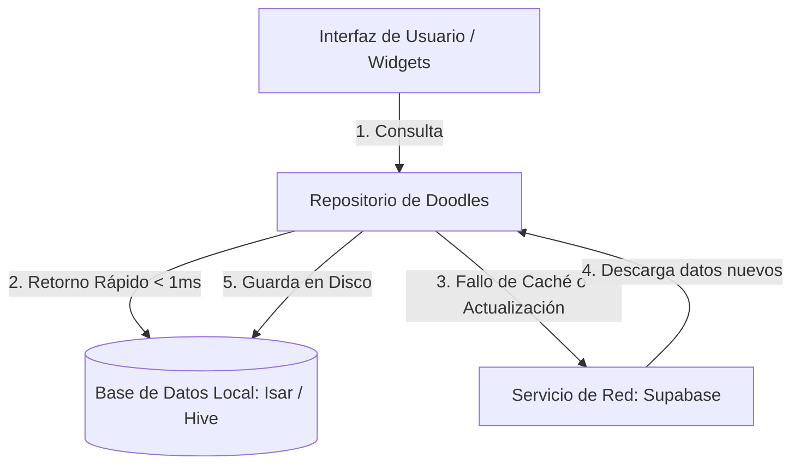

# ISSUE: Diseñar e Implementar un Sistema de Sincronización y Caché Global de Doodles (Offline-First)

* **Estado**: Propuesto / Pendiente (Backlog)
* **Severidad**: Media-Alta (Optimización y Escalabilidad)
* **Etiquetas**: `enhancement`, `performance`, `offline`, `architecture`, `database`

---

## 1. Contexto y Problema

Actualmente, la aplicación móvil realiza peticiones HTTP directas a la base de datos de Supabase cada vez que necesita cargar los trazos vectoriales de los doodles. Esto incluye:
- Cargar las tarjetas del feed principal (`DoodleCard`).
- Renderizar avatares personalizados (`DoodleAvatar`).
- Visualizar el historial propio o de otros usuarios en sus respectivos perfiles.

### Puntos Críticos Actuales:
1. **Coste e Infraestructura (Supabase)**: Cada vez que un usuario hace scroll en el feed o lee hilos de comentarios, se desencadenan decenas de consultas individuales a la base de datos para obtener los datos JSONB de los doodles. A escala, esto consume cuotas de transferencia y lectura de Supabase muy rápido.
2. **Dependencia Total de Red**: Si un usuario tiene una conexión lenta o nula (ej. túneles, metro, modo avión), las fotos de perfil vectoriales y las tarjetas del feed fallan al cargar o muestran constantes animaciones de carga, arruinando la fluidez.
3. **Pérdida de Dibujos en Progreso**: Si el usuario está dibujando en el lienzo y pierde la conexión a internet o la aplicación se cierra inesperadamente, no hay un mecanismo de autoguardado persistente local que proteja su lienzo para continuarlo después.

---

## 2. Solución Propuesta

Aprovechando que los doodles son **datos vectoriales puros** (fórmulas y coordenadas almacenadas en JSON) y no pesadas imágenes de mapa de bits (PNG/JPG), se propone diseñar un **sistema de almacenamiento híbrido local-remoto (Offline-First)**.

Un doodle promedio pesa solo **~5 KB**, por lo que guardar miles de ellos localmente en el móvil consumirá menos de **10 MB** en total, dando una caché inmensa con coste de almacenamiento local prácticamente nulo.

### Arquitectura Propuesta:


---

## 3. Guía de Implementación Paso a Paso

Para llevar a cabo esta optimización en el futuro, se recomiendan los siguientes pasos técnicos:

### Paso 1: Agregar Dependencias Locales
Se aconseja el uso de **Isar** o **Hive** por su alto rendimiento en Flutter y soporte nativo de JSON/objetos en memoria persistente:
```yaml
dependencies:
  isar: ^3.1.0
  isar_flutter_libs: ^3.1.0
  # o alternativamente: hive_flutter

dev_dependencies:
  isar_generator: ^3.1.0
  build_runner: ^2.4.0
```

### Paso 2: Definir el Modelo Local
Modelar un esquema local para indexar rápidamente los doodles descargados y marcar los borradores locales:
```dart
@collection
class LocalDoodle {
  Id id = Isar.autoIncrement;

  @Index(unique: true)
  late String doodleId;
  
  late String userId;
  late String authorName;
  late List<String> tags;
  late String doodleDataJson; // Los trazos convertidos a String JSON
  late DateTime createdAt;
  
  // Flag crítico para sincronización offline
  late bool isPendingSync; 
}
```

### Paso 3: Crear el Repositorio Unificado (`DoodleRepository`)
Implementar el patrón Repositorio para encapsular la lógica de decisión de datos:
- **Lectura**: Al pedir un doodle, se consulta la DB local. Si existe, se devuelve de inmediato. En paralelo, si hace falta, se consulta a Supabase si hay cambios o nuevas versiones (estrategia *Stale-While-Revalidate*).
- **Escritura**: Al crear un nuevo dibujo:
  1. Se guarda localmente marcando `isPendingSync = true`.
  2. Se intenta subir a Supabase.
  3. Si la subida tiene éxito, se actualiza localmente a `isPendingSync = false`.
  4. Si falla (sin red), la app avisa al usuario que se guardó localmente y que se subirá al recuperar conexión.

### Paso 4: Sincronización en Segundo Plano (Sincronizador / Sync Queue)
- Implementar un servicio de sincronización automática que escuche los cambios de red utilizando conectividad móvil (`connectivity_plus`).
- Al detectar red activa, ejecuta una tarea en segundo plano que sube todos los `LocalDoodle` marcados con `isPendingSync = true` en orden cronológico.

### Paso 5: Optimización de Tarjetas y Scroll
- Refactorizar `DoodleCard` y `DoodleAvatar` para obtener sus trazos desde el nuevo `DoodleRepository` local.
- Al hacer scroll, los trazos vectoriales se leen desde la base de datos local en menos de **1 ms**, logrando un scroll a 60/120 FPS ultrafluido y libre de saltos.

---

## 4. Impacto Esperado

- **Rendimiento de Interfaz**: Incremento drástico en la fluidez de carga (cero spinners al navegar por feeds o perfiles ya visitados).
- **Coste de Servidor**: Reducción de más del **80% de peticiones de base de datos** en Supabase, permitiendo soportar 5 a 10 veces más usuarios concurrentes en el tier gratuito.
- **Retención de Usuarios**: Excelente experiencia offline. Los usuarios no perderán dibujos a medio terminar si se quedan sin internet en mitad de un trazo.
