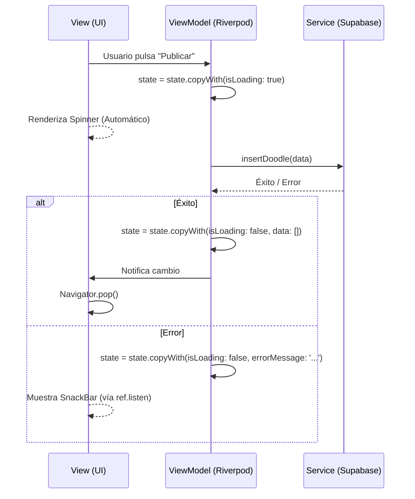

# Arquitectura MVVM Pragmática (Feature-Driven)

Este documento detalla el diseño técnico de `whatdoidraw?`. Se ha optado por una arquitectura **MVVM Pragmática** orientada a funcionalidades (**Features**), que equilibra la robustez de los estándares profesionales con la agilidad necesaria para un proyecto dinámico.

---

## 🧐 ¿Por qué "Pragmática"?

A diferencia de la *Clean Architecture* tradicional, que puede volverse excesivamente burocrática con capas de `domain` y `data` vacías, la arquitectura empleada simplifica la jerarquía sin perder el desacoplamiento. 

- **Menos carpetas, más claridad:** Solo 4 capas por feature.
- **Enfoque en el Estado:** El estado es el corazón de la reactividad.
- **Independencia de Infraestructura:** El código de negocio permanece agnóstico al uso de Supabase.

---

## 🏗️ Las 4 Capas de una Feature

Cada funcionalidad (ej: `content_creation`) reside en su propio directorio dentro de `lib/features/` y se divide en:

### 1. La Vista (`Views`)
Es la capa de interfaz pura.
- **Responsabilidad:** Renderizar widgets y delegar eventos del usuario.
- **Regla:** No debe contener lógica de negocio ni llamadas a base de datos.
- **Patrón:** Utiliza `ref.watch()` para redibujarse ante cambios de estado y `ref.listen()` para efectos secundarios (como mostrar un SnackBar ante un error).

### 2. El Estado (`State`)
Definido usualmente como una clase `@freezed`.
- **Responsabilidad:** Ser la única fuente de verdad técnica de la pantalla.
- **Campos Obligatorios:**
  - `isLoading`: Para mostrar spinners en la UI.
  - `errorMessage`: Para comunicación declarativa de fallos.
  - `data`: Los datos de dominio (ej: `List<StrokeModel>`).

### 3. El ViewModel (`Viewmodels`)
Orquestado por Riverpod (`Notifier` / `AsyncNotifier`).
- **Responsabilidad:** Transformar eventos de UI en mutaciones de estado inmutable.
- **Lógica:** Orquesta la comunicación con los servicios. El acceso al SDK de Supabase nunca se realiza de forma directa; se solicitan los datos a la capa de `Services`.

### 4. El Servicio (`Services`)
La capa de infraestructura.
- **Responsabilidad:** Comunicación con el mundo exterior (Supabase, APIs, Dispositivo).
- **Abstracción:** Retorna modelos de datos limpios o lanza excepciones controladas.

---

## 🔄 Flujo de Datos y Reactividad

El ciclo de vida de una operación (ej: Publicar un dibujo) sigue este flujo unidireccional:



---

## 🔑 Patrones Clave

### Inversión de Control (IoC)
Para evitar que el ViewModel dependa de tecnologías específicas, se inyectan los servicios a través de Riverpod. Por ejemplo, el `DoodleCanvas` consume el usuario actual a través de un `authControllerProvider` abstracto, lo que permite cambiar de Supabase a Firebase, por ejemplo,  sin modificar la lógica de dibujo.

### Inmutabilidad Estricta
Se emplea **Freezed** para garantizar que el estado no se pueda mutar accidentalmente. Para realizar cambios en un dato, se debe emitir un nuevo objeto de estado (`state = state.copyWith(...)`), lo que asegura que Riverpod detecte siempre el cambio y la UI sea coherente.

### Manejo Declarativo de Errores
En lugar de saturar los widgets con bloques `try-catch`, el ViewModel captura el error y lo sitúa en el estado (`errorMessage`). La View "escucha" este campo y reacciona en consecuencia. Esto mantiene la UI limpia y predecible.

---

## 📁 Resumen de Directorios

```text
lib/features/[nombre]/
├── services/       # Conectividad (SDKs, APIs)
├── viewmodels/     # Lógica y Notifiers
└── views/
    ├── screens/    # Pantallas completas
    └── widgets/    # Componentes reutilizables de la feature
```
