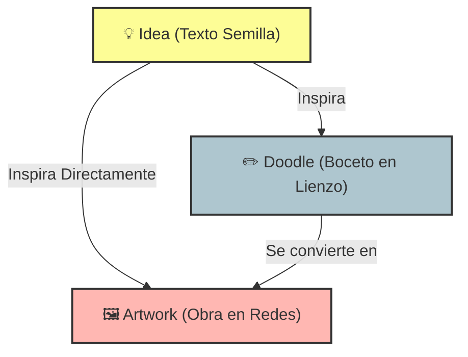

# whatdoidraw? (wdid?) 🎨✨

**whatdoidraw?** es una red social colaborativa diseñada especialmente para artistas y creadores con el objetivo de **combatir el bloqueo creativo**. A través de un ciclo continuo de inspiración, la plataforma conecta a los usuarios para transformar ideas abstractas en bocetos interactivos y, finalmente, en obras de arte terminadas.

---

<div align="center">

[](https://flutter.dev)
[](https://supabase.com)
[](https://riverpod.dev)
[](https://www.postgresql.org)
[](https://opensource.org/licenses/MIT)

</div>

---

## 💡 El Concepto: Linaje Creativo (Creative Lineage)

A diferencia de un portafolio convencional, **whatdoidraw?** visibiliza e interconecta la evolución de la inspiración a través de tres niveles jerárquicos:

1. **💡 Ideas (Prompts Semilla):** Nodos iniciales de texto donde cualquier usuario propone un concepto creativo (ej: *"Un gato astronauta tomando café"*).
2. **✏️ Doodles (Bocetos en Lienzo):** Dibujos vectoriales realizados en tiempo real dentro del lienzo interactivo de la app, basados o no en una Idea previa.
3. **🖼️ Artworks (Arte Final):** Obras terminadas publicadas en plataformas externas (Bluesky, DeviantArt, etc.) que se enlazan de forma interactiva a su Doodle o Idea original, documentando la genealogía completa de la pieza.



---

## 🛠️ Tecnologías & Arquitectura

### 1. 🖌️ Motor de Dibujo Vectorial 2D Nativo
* **Sin librerías externas:** Construido desde cero usando el poder de **`CustomPainter`** y **`GestureDetector`** en Flutter.
* **Serialización Ultra-Ligera (JSON Vectorial):** En lugar de subir pesados archivos de imagen (PNG/JPG) a la nube, la app captura los trazos del usuario como coordenadas matemáticas de vectores (`Offset`) y los serializa en un array **JSON** en PostgreSQL. Esto reduce drásticamente el espacio en base de datos (kilobytes en vez de megabytes) y permite que los bocetos se rendericen de forma nítida en cualquier pantalla, con soporte futuro para animar la creación del trazo.
* **Zoom & Interacción:** Integración con `InteractiveViewer` que equilibra de forma fluida el dibujo con un solo dedo y el desplazamiento/zoom táctil con dos dedos.

### 2. ⚡ Arquitectura & Estado Reactivo
* **Pragmatic MVVM (Feature-Driven):** Organización modular y desacoplada del código dividida en funcionalidades claras (Features), con separación estricta entre la UI (View), la lógica de negocio (ViewModel) y la infraestructura de datos (Service).
* **Riverpod con Generadores (`@riverpod`):** Reactividad eficiente y modular. Todo el estado del ViewModel se maneja como un objeto inmutable autogenerado mediante `@freezed`, con controladores reactivos específicos para manejar cargas, errores y datos en tiempo real.
* **UI Optimista:** Las interacciones frecuentes (como dar Likes o marcar favoritos) utilizan actualizaciones optimistas en la interfaz para dar una respuesta táctil instantánea al usuario antes de confirmar la transacción en el servidor.

### 3. 🗄️ Backend (Supabase & PostgreSQL)
* **Paginación Eficiente:** Carga diferida del feed mediante `.range()`, filtrado avanzado de etiquetas utilizando el tipo de dato nativo `VARCHAR[]` de Postgres y su operador `.contains()`, reduciendo costes de consulta.
* **Base de Datos Activa:** Triggers SQL y funciones Postgres personalizadas en Supabase para gestionar automáticamente los contadores de interacción y la distribución de notificaciones internas en tiempo real al detectar relaciones de inspiración.
* **Seguridad y Privacidad:** Políticas de Seguridad a Nivel de Fila (RLS) robustas para proteger los datos y la identidad de los usuarios en cada consulta directa.

### 4. 🎨 Sistema de Temas Dinámicos & Localización
* **Temas Personalizados Live:** Soporte de cambio de tema al vuelo persistido localmente con `SharedPreferences` (Deep Purple Oscuro, Nordic Clean Claro con regla 60-30-10, y Calm Dark Green Forest).
* **i18n Nativo:** Soporte de multi-idioma (Español e Inglés) sincronizado y persistente a nivel de usuario.

---

## 📂 Estructura del Código

```text
lib/
├── core/                       # Integraciones troncales y de infraestructura
│   ├── providers/              # Proveedores globales (Supabase, etc.)
│   ├── theme/                  # Sistema de diseño global (Colores, HSL, tipografías)
│   └── constants/              
├── features/                   # Módulos encapsulados por dominio
│   ├── feed/                   # Descubrimiento de Ideas, Doodles y Artworks
│   ├── canvas/                 # Motor de dibujo, ViewModel del lienzo y guardado
│   ├── notifications/          # Centro de notificaciones en tiempo real
│   └── ...                     
├── shared/                     # Código y componentes transversales
│   ├── models/                 # Modelos de dominio inmutables (Freezed)
│   └── widgets/                # UI común reutilizable (TagInputField, TagChip, etc.)
└── main.dart                   # Punto de entrada de la aplicación
```

---

## 📖 Documentación Interna

Para comprender a fondo la lógica y el diseño de la aplicación, puedes explorar las guías específicas:
* 🚀 **[Guía de Instalación](SETUP.md)**
* 🎨 **[Lienzo y Motor de Dibujo (Custom Canvas)](CANVAS_ENGINE.md)**
* ⛓️ **[Sistema de Linaje Creativo (Creative Lineage)](CREATIVE_LINEAGE.md)**
* 🏷️ **[Sistema de Tags & Feed](TAGS_SYSTEM.md)**
* 💖 **[Sistema de Likes Optimistas](LIKES_SYSTEM.md)**
* 🌐 **[Internacionalización y i18n](LANGUAGE_SYSTEM.md)**
* 🗄️ **[Esquema de Base de Datos SQL](DATABASE_SCHEMA.md)**
